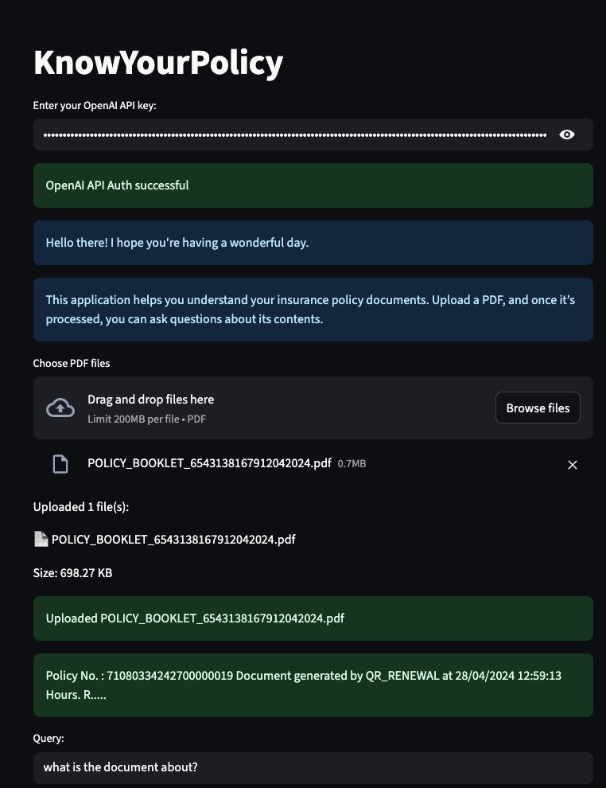

# 🛡️ KnowYourPolicy

**KnowYourPolicy** is a powerful and user-friendly web application that helps users understand their **insurance policy documents**. Upload your PDF, ask questions in natural language, and get AI-generated, reliable answers backed by actual text from your document.



---

## 📝 Description

Insurance policy documents are often long, complex, and filled with jargon—most of us don't have the time or patience to read and understand them in detail.

**KnowYourPolicy** is your personal AI assistant that reads and understands your policy for you. Simply upload your PDF, and you can **chat directly with your own insurance document**.

Ask it:
- What a specific clause means  
- Whether a condition is covered  
- The definition of confusing terms  
- Or anything else related to your document

It provides **accurate, source-backed answers**—no fluff, no guessing.

---

## ✨ Features

- 📄 **Upload and Read PDF Policies**  
  Upload multiple insurance policy documents and extract text using `PyPDF2`.

- 🧠 **AI-Powered Question Answering**  
  Ask questions about your policy using OpenAI’s GPT-3.5.

- 📚 **Smart Vector Search**  
  Efficiently finds the most relevant text chunks using ChromaDB and MMR search.

- 🔒 **Private and Secure**  
  Your documents and API key are handled locally in your browser session.

- ✅ **OpenAI Key Validation**  
  Ensures your API key works before you start.

---

## 🚀 Access the App

👉 **Use the app here**: [https://medicalpolicychatbot.onrender.com/](https://medicalpolicychatbot.onrender.com/)

---

## 🔐 OpenAI API Key

You’ll need your own OpenAI API key to use the application.

🎥 [Watch this video tutorial](https://youtu.be/05izydnrnZ4?si=u2tGXGprWsgWs3Ju) to learn how to get one.

---

## 🧪 How It Works

1. Paste your OpenAI API key when prompted.
2. Upload one or more **PDF policy documents**.
3. Ask a question like:
   ```
   What is covered under hospitalization?
   ```
4. Get a detailed response **with the exact source sentence** from your document.

---

## 🧼 End Session

Click **"End Session"** to:
- Clear all uploaded files
- Delete the vector database from memory

---

## ⚠️ Limitations

- Only supports **PDF** input files.
- Doesn't make up answers — only responds based on what's in your document.
- Requires a working OpenAI API key with embedding & chat access.

---

## 📄 License

[MIT](LICENSE)
